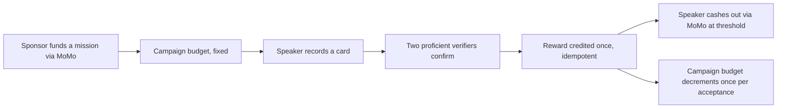

# AMAZWI — DECK SKELETON (L5)
### Pre-event reference scaffold for `06_PITCH.md` §10; evidence must come from the on-site build

**Status:** PARTIAL / REFERENCE ONLY — structure and prospective asset sourcing are sketched, but this is not a finished competition deck or a submission artifact. Assemble the deck on-site from the running competition build after the placeholders below are replaced.
**Rule inherited from `06_PITCH.md`:** slides are subordinate to the live app. If a slide and the app disagree, the app is right and the slide gets fixed.
**Evidence rule:** a pre-event Figma render or static mockup is a reference visual, not product proof. Only an on-site running-app capture may be labelled real build evidence. Where that does not exist yet, the slide remains a target or placeholder.

---

## Asset inventory (what exists as preparation on 31 Aug 2026)

| Asset | Source | Classification |
|---|---|---|
| Button, Banned-word chip, Card, Wallet-receipt component renders | Figma file `JPZuFmbhRh9fhkgBLxRymq`, nodes `5:13`/`6:5`/`7:24`/`10:24` | **Reference only** — pre-event design renders, not stored in this repository and not proof of the running competition app |
| Main / Recording / Understood mockup screens | `04_assets/mockups_v2/*.dc.html`, Artifact `27d81ae1-89f7-4f3c-91be-a29d972597b6` | **Reference only** — static pre-event design preparation, not the running app or a submission artifact |
| Reproducible clip/transcript comparison | — | **Placeholder.** On-site, Sbu must select and record an exact ASR model/version and decoding settings, run it once per `06_PITCH.md` §3, and preserve the output. No model is currently named — this blocks Slide 1 being real |
| Funded-mission-loop diagram | — | **Placeholder.** `04_assets/FIGMA.md` names `figma-generate-diagram` (Mermaid → FigJam) as the intended source; not built. A plain Mermaid version is inlined below as a stand-in |
| Aggregate Impact Map | — | **Placeholder.** Does not exist until Gate F/G produce real reward events to aggregate |
| Live app screenshots (Gate A–H) | — | **Placeholder for everything downstream of today.** Every "interim" asset below gets swapped for a real running-app screenshot the moment its gate exists — see the swap column |

---

## SLIDE 1 — Reproducible clip/transcript comparison

**Visual:** PLACEHOLDER — the clip and transcript comparison itself. Swap it in only after Sbu records and runs the exact selected model/version on-site.
**Script (quoted verbatim, `06_PITCH.md` §3):**
> "Who understood that?"
> [Show the reproducible transcript comparison]
> "People understood the speaker. The system struggled. Existing South African datasets are valuable, but an ordinary person still has no continuous, consumer way to contribute governed voice and see its value."

**Do not say:** "no system on earth," "Google skipped us," or substitute a cross-language benchmark.

---

## SLIDE 2 — Product sentence

**Visual:** Typographic only — no image needed. After Gate B closes on-site, optionally use a capture of the running Card screen as a small supporting graphic bottom-right. The pre-event Figma render is reference only.
**Script (verbatim, §1 and §3):**
> "AMAZWI is a MoMo voice game. Play a challenge in your language. When two people understand you, your reward is credited through MoMo."

Memory line, repeated at the close: **"Speak. Be understood. Earn."**

---

## SLIDE 3 — Live game

**No slide.** Per `06_PITCH.md` §2 and §4, this beat is the actual running app on one speaker device and two verifier devices, Lethabo narrating, Sbu monitoring provider state. Do not build a slide that competes with it.

**Backup target** if live totally fails (§12 Failure Moves: "Total live failure → play the local fallback recording"): capture the on-site Card, Banned-word, action and Wallet-receipt states from the running app. Pre-event Figma renders are not a no-network competition fallback. This remains a last-resort appendix, not a planned slide — see "Backup appendix" at the bottom of this file.

---

## SLIDE 4 — Voice Value Receipt

**Visual:** **REFERENCE ONLY** — Wallet-receipt Figma node `10:24`. It is not product evidence and its player-facing "corpus eligible" wording must be replaced with plain-language copy before use. Gate F supplies the actual receipt capture from the running app.
**Becomes usable at:** Gate F, after the actual receipt screen shows the real contribution and every simulated provider/data value is labelled.
**Script (verbatim, §6):**
> "One screen proves what was contributed, why it qualified, what it earned, what the person consented to and where the value is now."

Show alongside: contribution ID, declared language, peer-verified semantic label, two independent verifier events, audio-quality result, eligibility decision, published reward rule and credited amount, consent version, campaign/provider mode, settlement state, currency disclosure (§6 full list) — the Figma component currently renders a subset for craft purposes; the real Gate F screen must show the full list.

---

## SLIDE 5 — Wallet / provider states

**Visual:** **REFERENCE ONLY** — the Wallet-receipt component (`10:24`) and `provider_unavailable` copy establish the intended hierarchy. They are not evidence that provider transitions work.
**Becomes usable at:** Gate F, once the running app produces truthful provider-state captures (credited → submitted → pending → paid, per §5).
**Script (verbatim, §5):**
> "The wallet distinguishes credited, submitted, pending and paid. An accepted provider request is not money moved. Repeating the resolver or callback does not create another reward."
> [if demo provider active] "This external settlement leg is our labelled demo provider because South African hackathon disbursement is not available to us. The state machine and idempotency are real; we are not presenting simulated rands as a production transfer."

---

## SLIDE 6 — Funded mission loop

**Visual:** PLACEHOLDER for a proper FigJam/Mermaid diagram (see `04_assets/FIGMA.md`). Stand-in below — replace, don't present this raw code block on stage:

**Script (verbatim, §7):**
> "A sponsor funds a language mission through MoMo. Accepted speaker rewards are credited in an auditable ledger and cash out through MoMo at a viable threshold. That makes MoMo the funding and settlement rail, not a payment button attached at the end."

**Do not:** criticise Ayoba, historic MoMo launches, or assert MTN already owns/lacks a data asset.

---

## SLIDE 7 — Compact mission economics / metrics

**Visual:** Text/table only. Numbers pulled only from `03_BUSINESS.md` §§1–5 and the "Current P0 scope overrides" in `BUILD_LOG.md` — nothing else is pitch-safe.
**Content:**
- Sponsored language mission (fixed campaign budget, decrements once per accepted contribution)
- Published speaker honorarium (illustrative R2, not a unit-economics claim — provider fees/acceptance/production cost are pilot measurements, not pitch figures)
- Points-only verifiers (no cash incentive to collude on the semantic check)
- Immediate ledger credit; provider cash-out only at a confirmed viable threshold

**Explicit guardrail (§8):** "The R2 amount is illustrative until provider fees, minimums, acceptance and repeat play are measured. Do not quote a profit margin per ASR-ready hour."

---

## SLIDE 8 — Official judging criteria mapped to target proof

**Visual:** A table built directly from the organiser's five criteria. Every row below is a **target**, not a current claim. Change TARGET to PROVEN only after the named on-site gate or rehearsal has passed and the evidence is visible in the app.

| Criterion | Target proof — conditional until verified on-site |
|---|---|
| Innovation | **TARGET:** show two independent proficient listeners determining eligibility, with learner play visibly separated from governed verification |
| Fintech Relevance | **TARGET (Gates F/G):** show a funded mission, one auditable ledger credit and an honestly labelled MoMo/demo-provider settlement boundary |
| Feasibility | **TARGET (Gate H + L6):** complete and rehearse the judge-only golden path, including named failure substitutions, twice from reset |
| Technical Execution | **TARGET (S3/S5 + Gates E/F):** demonstrate the exact-match `is_correct` contract, idempotent ledger and truthful provider states in the running receipt |
| Presentation | **TARGET (L5/L6):** use the live on-site build as the presentation; show only captured proof and rehearse so either teammate can present alone |

---

## SLIDE 9 — What we did not build

**Visual:** Text only. **Verbatim from `06_PITCH.md` §10 — do not soften or drop any line:**
- no transcript or ASR retraining;
- two quality-assured languages, not twelve;
- no public raw-audio archive;
- sandbox/demo-provider legs visibly labelled;
- closed-cohort feasibility, not nationwide liquidity.

---

## SLIDE 10 — Aggregate Impact Map and ask

**Visual:** PLACEHOLDER — does not exist until real reward events exist to aggregate (Gate F/G). Do not fabricate sample data for this slide; an empty/seeded Impact Map with an honest "seeded for demo" label is preferable to invented numbers.
**Script (verbatim, §9):**
> "This voice stayed under the contributor's control. The value moved visibly. And the country gained one more governed language signal."
> **"Speak. Be understood. Earn."**
> "Give Team Sonar one contained MoMo voice-intent mission, the real South African payment constraints and the Mini App product team. We will measure the quality, cost and repeat play before claiming scale."

Stop there — §9 is explicit that the ask ends the pitch, no trailing slide after it.

---

## Backup appendix — static screenshots for total live failure

Per `06_PITCH.md` §12, a total live failure falls back to an on-site recording of the running app first. If even that is unavailable, use on-site screenshots of the actual build in order: Card → banned-word constraint → primary action → Wallet receipt. The current Figma components may guide composition, but they are pre-event references and cannot serve as competition-build proof. Say plainly whenever a fallback is a static walkthrough.

---

## Open items before this stops being a reference skeleton

1. On-site: choose and record the exact ASR model/version, decoding settings, permitted opening clip and preserved output (§3); no model is currently named.
2. On-site: build the funded-mission-loop diagram and replace the inline Mermaid stand-in on Slide 6.
3. Replace every reference render and placeholder with a capture from a passed build gate; label all seeded/demo values.
4. Prepare the judge-only script, no-network fallback recording and static capture pack on both laptops and a phone.
5. Rehearse the complete demo so every judging-criteria row can be changed from TARGET to PROVEN honestly.
