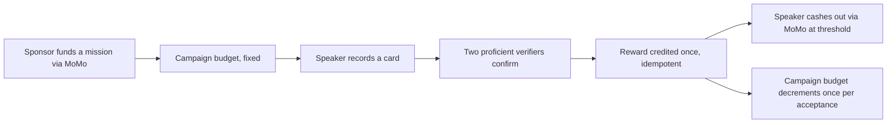

# AMAZWI — DECK SKELETON (L5)
### Slide-by-slide scaffold for `06_PITCH.md` §10, real assets only

**Status:** SKELETON — structure and asset sourcing settled, not a finished deck. Assemble in Gamma/Slides/PowerPoint at the event once the placeholder assets below are replaced.
**Rule inherited from `06_PITCH.md`:** slides are subordinate to the live app. If a slide and the app disagree, the app is right and the slide gets fixed.
**Every visual below is labelled with its real source.** None is invented; where nothing real exists yet, it says so and names the gate that produces it.

---

## Asset inventory (what's real today, 31 Aug 2026)

| Asset | Source | Real or placeholder |
|---|---|---|
| Button, Banned-word chip, Card, Wallet-receipt component screenshots | Figma file `JPZuFmbhRh9fhkgBLxRymq`, nodes `5:13`/`6:5`/`7:24`/`10:24` | **Real** — actual rendered design-system components, built and screenshotted 31 Aug |
| Main / Recording / Understood mockup screens | `04_assets/mockups_v2/*.dc.html`, Artifact `27d81ae1-89f7-4f3c-91be-a29d972597b6` | **Real** — high-craft mockup, not wireframe, but not the running app either |
| Reproducible clip/transcript comparison | — | **Placeholder.** Needs Sbu to run the named ASR model/version once, per `06_PITCH.md` §3, and preserve the output. Nobody has done this yet — it is not blocking L5 but it blocks Slide 1 being real |
| Funded-mission-loop diagram | — | **Placeholder.** `04_assets/FIGMA.md` names `figma-generate-diagram` (Mermaid → FigJam) as the intended source; not built. A plain Mermaid version is inlined below as a stand-in |
| Aggregate Impact Map | — | **Placeholder.** Does not exist until Gate F/G produce real reward events to aggregate |
| Live app screenshots (Gate A–H) | — | **Placeholder for everything downstream of today.** Every "interim" asset below gets swapped for a real running-app screenshot the moment its gate exists — see the swap column |

---

## SLIDE 1 — Reproducible clip/transcript comparison

**Visual:** PLACEHOLDER — the clip and transcript comparison itself. Swap in the moment Sbu runs the named model.
**Script (quoted verbatim, `06_PITCH.md` §3):**
> "Who understood that?"
> [Show the reproducible transcript comparison]
> "People understood the speaker. The system struggled. Existing South African datasets are valuable, but an ordinary person still has no continuous, consumer way to contribute governed voice and see its value."

**Do not say:** "no system on earth," "Google skipped us," or substitute a cross-language benchmark.

---

## SLIDE 2 — Product sentence

**Visual:** Typographic only — no image needed. Optionally the Card component screenshot (`7:24`, real) as a small supporting graphic bottom-right, since it's the first concrete artifact the audience sees.
**Script (verbatim, §1 and §3):**
> "AMAZWI is a MoMo voice game. Play a challenge in your language. When two people understand you, your reward is credited through MoMo."

Memory line, repeated at the close: **"Speak. Be understood. Earn."**

---

## SLIDE 3 — Live game

**No slide.** Per `06_PITCH.md` §2 and §4, this beat is the actual running app on one speaker device and two verifier devices, Lethabo narrating, Sbu monitoring provider state. Do not build a slide that competes with it.

**Backup only** if live totally fails (§12 Failure Moves: "Total live failure → play the local fallback recording"): have the Card, Banned-word-chip, Button and Wallet-receipt screenshots (all real, all four nodes above) ready as an emergency static walkthrough if even the fallback video is unavailable. This is a last-resort appendix, not a planned slide — see "Backup appendix" at the bottom of this file.

---

## SLIDE 4 — Voice Value Receipt

**Visual:** **Real** — Wallet-receipt component screenshot, Figma node `10:24`. Shows status (`UNDERSTOOD — corpus eligible`), amount bound to `rand-money-only`, the "Sent for payment" language (never "Paid"), and the two-verifier confirmation line.
**Swap at:** Gate F, for the actual receipt screen of the real contribution just made live on stage.
**Script (verbatim, §6):**
> "One screen proves what was contributed, why it qualified, what it earned, what the person consented to and where the value is now."

Show alongside: contribution ID, declared language, peer-verified semantic label, two independent verifier events, audio-quality result, eligibility decision, published reward rule and credited amount, consent version, campaign/provider mode, settlement state, currency disclosure (§6 full list) — the Figma component currently renders a subset for craft purposes; the real Gate F screen must show the full list.

---

## SLIDE 5 — Wallet / provider states

**Visual:** **Real** — same Wallet-receipt component (`10:24`), paired with the `provider_unavailable` copy from `content/error_states.json` ("Payments are running on our test system right now") as the second state shown.
**Swap at:** Gate F, once real provider-state transitions exist to screenshot (credited → submitted → pending → paid, per §5).
**Script (verbatim, §5):**
> "The wallet distinguishes credited, submitted, pending and paid. An accepted provider request is not money moved. Repeating the resolver or callback does not create another reward."
> [if demo provider active] "This external settlement leg is our labelled demo provider because South African hackathon disbursement is not available to us. The state machine and idempotency are real; we are not presenting simulated rands as a production transfer."

---

## SLIDE 6 — Funded mission loop

**Visual:** PLACEHOLDER for a proper FigJam/Mermaid diagram (see `04_assets/FIGMA.md`). Stand-in below — replace, don't present this raw code block on stage:

**Script (verbatim, §7):**
> "A sponsor funds a language mission through MoMo. Accepted speaker rewards are credited in an auditable ledger and cash out through MoMo at a viable threshold. That makes MoMo the funding and settlement rail, not a payment button attached at the end."

**Do not:** criticise Ayoba, historic MoMo launches, or assert MTN already owns/lacks a data asset.

---

## SLIDE 7 — Compact mission economics / metrics

**Visual:** Text/table only. Numbers pulled only from `03_BUSINESS.md` §§1–5 and the "Current P0 scope overrides" in `BUILD_LOG.md` — nothing else is pitch-safe.
**Content:**
- Sponsored language mission (fixed campaign budget, decrements once per accepted contribution)
- Published speaker honorarium (illustrative R2, not a unit-economics claim — provider fees/acceptance/production cost are pilot measurements, not pitch figures)
- Points-only verifiers (no cash incentive to collude on the semantic check)
- Immediate ledger credit; provider cash-out only at a confirmed viable threshold

**Explicit guardrail (§8):** "The R2 amount is illustrative until provider fees, minimums, acceptance and repeat play are measured. Do not quote a profit margin per ASR-ready hour."

---

## SLIDE 8 — Official judging criteria mapped to proof

**Visual:** A table, built directly from the organiser's five criteria against what's actually proven. Fill the right column only with things that will be true and live on stage — do not pre-write a claim for a gate that hasn't shipped.

| Criterion | Proof point |
|---|---|
| Innovation | Peer-verification-as-validation (two independent listeners, not an ASR judge); learner/verifier split so play scales without diluting corpus quality |
| Fintech Relevance | MoMo is the funding *and* settlement rail — a sponsor funds the mission, the ledger pays the speaker — not a payment button bolted onto an unrelated app |
| Feasibility | Judge-only golden path rehearsed with named failure-move substitutions for every point of failure (§12) |
| Technical Execution | Idempotent ledger, exact-match `is_correct` contract, honest provider-state labelling — shown live in the receipt, not claimed in prose |
| Presentation | Judge-only live demo *is* the presentation; slides are subordinate per the pitch contract's own rule |

---

## SLIDE 9 — What we did not build

**Visual:** Text only. **Verbatim from `06_PITCH.md` §10 — do not soften or drop any line:**
- no transcript or ASR retraining;
- two quality-assured languages, not twelve;
- no public raw-audio archive;
- sandbox/demo-provider legs visibly labelled;
- closed-cohort feasibility, not nationwide liquidity.

---

## SLIDE 10 — Aggregate Impact Map and ask

**Visual:** PLACEHOLDER — does not exist until real reward events exist to aggregate (Gate F/G). Do not fabricate sample data for this slide; an empty/seeded Impact Map with an honest "seeded for demo" label is preferable to invented numbers.
**Script (verbatim, §9):**
> "This voice stayed under the contributor's control. The value moved visibly. And the country gained one more governed language signal."
> **"Speak. Be understood. Earn."**
> "Give Team Sonar one contained MoMo voice-intent mission, the real South African payment constraints and the Mini App product team. We will measure the quality, cost and repeat play before claiming scale."

Stop there — §9 is explicit that the ask ends the pitch, no trailing slide after it.

---

## Backup appendix — static screenshots for total live failure

Per `06_PITCH.md` §12, a total live failure falls back to a recorded video first. If even that is unavailable, these four **real** component screenshots (not the live app, but not invented either) can carry a narrated static walkthrough of the golden path in order: Card (`7:24`, the speaker sees this) → Banned-word chip (`6:5`, what they must avoid) → Button (`5:13`, the flow's own affordance) → Wallet-receipt (`10:24`, the outcome). Never present this appendix as if it were the live app — say plainly it's a static walkthrough.

---

## Open items before this stops being a skeleton

1. Sbu: run the named ASR model on the opening clip (§3) — the one blocker for Slide 1 being real.
2. Build the funded-mission-loop diagram in FigJam (`figma-generate-diagram`) — replace the inline Mermaid stand-in on Slide 6.
3. Nothing else on this page should be touched until a gate produces the real asset it's placeholder for — resist writing sample numbers into Slide 10 "to see how it looks."
