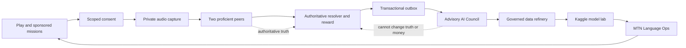
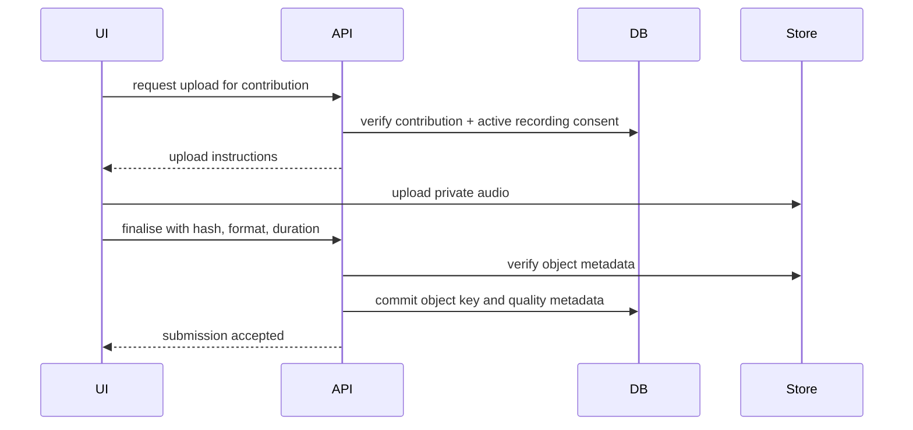

# AMAZWI Governed Intelligence Flywheel

- **Status:** Approved design, implementation not started
- **Approved by:** Lethabo, 01 September 2026
- **Architecture choice:** Governed Intelligence Flywheel
- **Live-scope ambition:** Maximum, delivered as independently survivable stages
- **Visual direction:** Signal Flow, with Midnight Shweshwe and Signal Daylight as equal first-class themes
- **Canonical Figma file:** `JPZuFmbhRh9fhkgBLxRymq`

> This document records an approved expansion of AMAZWI. It does not claim that
> consent enforcement, private audio, AI orchestration, model training, the new
> Figma system or the MTN Language Ops view already exist. Existing build truth
> remains in `P0.md` and `BUILD_LOG.md` until each stage passes its exit gate.
>
> The unresolved Sbu/Lethabo pre-event build-timing disagreement remains open.
> Lethabo approved this design on his own authority. Cross-lane implementation
> remains pending Sbu's review and is never represented as Sbu's final sign-off.

---

## 1. Product thesis

AMAZWI is a consumer language game that turns governed participation into three
connected forms of value:

1. **Engagement:** sponsored missions, social progress, XP and transparent MoMo
   rewards create a reason to return.
2. **Governed language assets:** peer truth, separate training consent,
   provenance and revocation controls create useful evaluation and training
   material.
3. **Multilingual intelligence:** specialist models identify model blind spots,
   prioritise the next mission and produce deployable language-readiness assets
   for MTN support, sales and self-service use cases.

The memorable product statement is:

> **People produce the truth. AMAZWI identifies what the model must learn next.**

AI is advisory after peer verification. It does not replace the two proficient
verifiers, set an individual's reward, revoke consent or silently export data.

---

## 2. Goals

### 2.1 Product goals

- Complete Gate C consent enforcement.
- Complete Gate D private cross-device audio.
- Complete Gate E's real two-verifier path.
- Make training/retention a separate explicit opt-in that is not required to
  earn the configured contribution reward.
- Add a recoverable post-resolution AI Council that can fail without affecting
  peer truth or money.
- Create a reproducible data-refinery path combining licensed external data and
  separately opted-in AMAZWI data without silently mixing provenance.
- Train and evaluate isiZulu and Setswana speech adapters using the team's two
  30-hour Kaggle GPU budgets.
- Use LightGBM and XGBoost where tabular models are technically appropriate,
  not as decorative technology names.
- Build an MTN-facing Language Ops view that closes the participation → asset →
  deployment loop.
- Rework the UI into a modern, rounded and fluid Signal Flow system in Figma
  before implementing it in React.

### 2.2 Business goals

Use a combined business ladder:

1. consumer engagement and recurring Mini App opens;
2. sponsored language missions funded through published campaign budgets;
3. a governed acquisition service for defined language/domain/quality gaps;
4. evaluation sets, error taxonomies and model-adapter work for MTN language
   operations;
5. measured multilingual support/self-service improvement in a pilot.

No unsupported revenue, savings, support-containment or per-hour claims enter
pitch material. These outcomes are hypotheses until measured.

### 2.3 Demonstration goal

A judge records a difficult code-switched clue. Two proficient peers understand
it. One configured reward posts. The current model misses it. The advisory AI
Council identifies a specific blind spot, the aggregate Coverage Constellation
updates, and the MTN view recommends the next sponsored mission.

The story is not “AI judged a person.” It is “people supplied authoritative
truth, and the system learned what to improve next.”

---

## 3. Non-goals and hard boundaries

- AI never overrides peer eligibility or changes a posted reward.
- Training consent is not a condition for earning a configured contribution
  reward.
- No public raw-audio archive.
- No public named attribution in the competition flow.
- No face recognition, voice biometrics or speaker-identity matching.
- No voice cloning, speech synthesis or TTS using Swivuriso data.
- No user-camera video is required for the first multimodal feature.
- No dynamic individual payout based on language, ethnicity, accent, rarity or
  a model's estimate of personal value.
- No chance mechanic, spin wheel or random cash outcome.
- No ML model is named as running until its real artefact and evaluation exist.
- No AI-generated person or generic pan-African imagery appears as documentary
  product content.
- The paused Vercel deployment is not resumed without explicit approval.

---

## 4. System architecture

The system is divided into seven stages with explicit authority boundaries.

### 4.1 Core authority plane

The following remain deterministic and transactional:

- consent grants and revocations;
- contribution and assignment states;
- peer answers and violation votes;
- eligibility decisions;
- campaign budget and immutable reward events;
- provider payment state;
- export authorisation.

### 4.2 Advisory intelligence plane

AI jobs consume an already-committed `ContributionResolved` event and produce
versioned advisory output. AI jobs do not participate in the transaction that
posts the peer decision and reward.

### 4.3 Training plane

The training plane receives only approved immutable dataset manifests. It never
queries unrestricted production audio directly and never treats an application
row as training consent by inference.

---

## 5. Consent and governance

### 5.1 Required scopes

The approved consent vocabulary maps to the existing product contract:

1. `RECORD_PROCESS_ROUND`
2. `ASSIGNED_VERIFIER_PLAYBACK`
3. `RETAIN_MODEL_DEVELOPMENT`
4. `PUBLIC_AUDIO_ATTRIBUTION`

Scope 4 remains off by default and outside the competition flow.

### 5.2 Separate training opt-in

`RETAIN_MODEL_DEVELOPMENT` is explicit and separate. A contributor who declines
it may still complete a round and earn the configured reward if the peer and
quality rules pass. Their audio is excluded from model-development exports.

### 5.3 Server-side enforcement points

Active scopes are derived from `ConsentGrant` rows, not caller-supplied Boolean
flags, at:

- contribution creation;
- audio upload completion;
- assignment creation and playback URL issuance;
- eligibility resolution;
- private contributor replay;
- model-development export;
- any research use.

### 5.4 Revocation

Revocation:

- sets `revoked_at` on relevant grants;
- blocks new assignments, playback URLs and exports;
- retires or quarantines audio according to the retention policy;
- preserves an audit tombstone and immutable financial records;
- does not claw back earned money;
- does not claim instantaneous model unlearning.

### 5.5 Audit evidence

Every grant, revocation, enforcement rejection and export decision records:

- actor;
- user and contribution identifiers;
- consent version and scope;
- timestamp;
- reason;
- software rule version;
- related dataset manifest where applicable.

---

## 6. Private audio architecture

Private application audio and external training datasets are different systems.

### 6.1 PostgreSQL responsibility

PostgreSQL stores:

- contribution metadata;
- object keys, format, duration and hashes;
- quality features and decisions;
- consent and revocation state;
- peer labels;
- eligibility, reward and audit records;
- outbox events and AI advisory outputs.

It does not store production audio blobs.

### 6.2 Object-storage responsibility

An adapter provides:

- upload initiation;
- upload finalisation and hash verification;
- short-lived signed playback for the assigned verifier;
- contributor-private replay where consent remains active;
- quarantine/retirement after revocation;
- deletion according to the retention policy.

Local development may use a local adapter. Deployment uses a private
S3-compatible provider selected only after the paused deployment decision is
reopened. No bucket or object is public.

### 6.3 Upload flow

A failed upload never creates a phantom submitted contribution. Raw audio is not
persisted in an offline outbox.

### 6.4 Quality checks

Initial physical checks remain deterministic:

- supported codec/container;
- duration rule;
- silence ratio;
- clipping ratio;
- basic signal/noise indicators;
- playback/retry before submission where available.

The Sound Sentinel may later predict re-record risk, but it does not replace
these hard checks or peer intelligibility.

---

## 7. Peer truth and Gate E

### 7.1 Assignment

- assignment is random within an eligible closed language cohort;
- speaker cannot verify their own clip;
- same verifier cannot receive the same contribution twice;
- learner MCQ assignments do not count;
- revoked, voided and expired audio cannot be assigned;
- playback URLs are short-lived and assignment-bound.

### 7.2 Verifier flow

1. listen privately;
2. enter free text before reveal;
3. submit a banned-word violation vote;
4. store raw answer, normalised answer and match-rule version;
5. reveal only after submission.

### 7.3 Resolver

The existing atomic resolver remains the authority. The temporary explicit
`consent_active` Boolean is replaced by a server-side derived consent result and
recorded consent version.

### 7.4 Expiry and recovery

Fewer than two proficient answers remains `OPEN` until expiry. Recovery actions
are authenticated and idempotent. No background task is treated as durable
without an outbox/recovery mechanism.

---

## 8. Advisory AI Council

The Council consists of independently versioned specialists.

### 8.1 Data Steward

Inputs:

- consent grants/revocations;
- source licence and use restrictions;
- transformation history;
- object and manifest hashes.

Outputs:

- `TRAINING_READY`, `BLOCKED_CONSENT`, `BLOCKED_LICENCE`,
  `BLOCKED_REVOKED`, or `REVIEW_REQUIRED`;
- reason codes and evidence.

The Data Steward cannot grant consent or approve an export by itself.

### 8.2 Sound Sentinel

Inputs:

- deterministic audio features;
- device/codec metadata;
- peer outcomes;
- known duplicate/replay indicators.

Outputs:

- re-record-risk score;
- anomaly priority;
- physical-quality explanation.

It cannot set corpus eligibility or accuse a user of fraud automatically.

### 8.3 Language Scout

Inputs:

- peer labels;
- ASR transcript candidate where available;
- multilingual embeddings;
- language/domain campaign metadata.

Outputs:

- code-switch pattern;
- model blind-spot category;
- semantic/domain coverage gaps;
- duplicate/near-duplicate prompt warnings.

### 8.4 Mission Architect

Inputs:

- aggregate coverage gaps;
- model error buckets;
- sponsor business priority;
- campaign budget;
- participation and completion data.

Outputs:

- ranked mission proposals;
- expected coverage contribution;
- evidence and uncertainty.

A human approves mission creation, budget and published reward. The model never
prices an individual.

### 8.5 Explainer

The Explainer converts signed structured specialist output into plain-language
receipt and dashboard copy. It is replaceable and receives redacted structured
facts rather than unrestricted raw audio.

### 8.6 Prohibited agent actions

No agent may directly:

- change eligibility;
- post or reverse reward money;
- grant/revoke consent;
- delete/quarantine audio;
- launch a campaign;
- approve an export;
- change a model deployment alias.

---

## 9. Reliable orchestration

### 9.1 Transactional outbox

The resolver transaction writes:

- final contribution state;
- eligibility decision;
- reward event and campaign commitment;
- `ContributionResolved` outbox event.

A recoverable worker claims outbox rows and runs Council specialists. Every job
is idempotent on `(event_id, specialist, model_version)`.

### 9.2 Job output

Each advisory output records:

- event ID;
- specialist name and software/model version;
- structured input hash;
- structured output;
- confidence/calibration where applicable;
- timestamps and retry count;
- failure reason.

### 9.3 Failure isolation

- AI unavailable: peer decision, reward, wallet and receipt work.
- Worker crash: outbox retries safely.
- One specialist fails: other specialists may complete.
- Explainer fails: structured evidence remains visible.
- Training unavailable: no new model-improvement claim is displayed.

---

## 10. Data refinery and provenance firewall

### 10.1 Source classes

Every record belongs to exactly one source class:

- external licensed dataset;
- AMAZWI separately opted-in contribution;
- evaluation-only dataset;
- synthetic test fixture.

Source classes are never silently merged.

### 10.2 Manifest fields

A dataset manifest records:

- immutable dataset ID/version;
- source repository and revision;
- licence and additional restrictions;
- allowed tasks;
- language/domain;
- contributor consent version for AMAZWI rows;
- transforms and tool versions;
- source and output hashes;
- speaker-safe train/dev/test membership;
- excluded/revoked row list;
- approval actor and timestamp.

### 10.3 External seed stack

#### Swivuriso / ZA-African Next Voices

- primary external ASR seed;
- approximately 3,000 hours across seven South African languages;
- isiZulu and Setswana included;
- scripted and unscripted speech;
- gated CC BY 4.0 dataset;
- explicitly prohibits TTS, voice cloning, synthesis and technologies intended
  to replicate/generate human voices.

#### AfriSwitch

- 61.36-hour natural code-switch benchmark;
- includes Zulu and Tswana;
- switch-level English tags, code-mixing metrics and switch-point counts;
- CC BY 4.0;
- used primarily as a held-out code-switch evaluation resource unless its
  dataset card permits the exact planned training use.

#### Common Voice 26 Setswana

- CC0;
- approximately 4.93 total hours and 4.26 validated hours;
- 18 speakers, so it must not be treated as representative by itself;
- useful as a supplementary scripted benchmark with speaker-safe splits.

#### NCHLT, Lwazi and FLEURS

Secondary benchmarks and domain-shift checks. Their exact licences, hosted
versions and use restrictions are verified and captured in the manifest before
any files enter the pipeline.

### 10.4 AMAZWI data

Only a contribution that is:

- peer-decided;
- quality-acceptable;
- separately opted into retention/model development;
- not revoked;
- not blocked by a licence or audit rule;
- included in an approved immutable export

may enter model development.

---

## 11. Model portfolio

### 11.1 Non-ML authority

Consent, peer truth, money and export approval remain non-ML.

### 11.2 LightGBM and XGBoost

Candidate uses:

- audio re-record risk from signal/device/codec features;
- contribution anomaly prioritisation;
- engagement/churn and quest recommendation;
- aggregate coverage-value ranking for sponsored mission proposals.

Requirements:

- deterministic/rule baseline;
- XGBoost and LightGBM challenger comparison;
- held-out evaluation;
- calibration;
- SHAP or equivalent feature-attribution review;
- protected-language/demographic leakage audit;
- no impact on individual reward amount or peer eligibility.

If the model does not beat the baseline for its actual acceptance metric, rules
remain in production and the result is documented honestly.

### 11.3 Speech models

The Kaggle campaign evaluates candidates rather than selecting by reputation.
Initial candidates include:

- Whisper large-v3-turbo with parameter-efficient adaptation;
- W2V-BERT 2.0 or an African-language derivative where licence/support fit;
- XLS-R/MMS or another strong multilingual comparator justified by the current
  benchmark literature.

One winner may be selected per language. A single architecture is not forced if
isiZulu and Setswana evidence differs.

### 11.4 Audio embeddings

Speech embeddings support:

- novelty and duplicate clustering;
- acoustic-condition coverage;
- representative sample selection;
- active-learning queues.

They are not used for biometric identity or uniqueness.

### 11.5 Semantic models

Multilingual embeddings support:

- semantic-label clustering;
- duplicate prompt detection;
- domain coverage;
- code-switch/error taxonomy retrieval.

A hosted LLM may explain structured evidence. The hosted planning/coding model
used by the team is not fine-tuned with AMAZWI audio and is not the product's
speech model.

### 11.6 Multimodal stretch: Sponsored Visual Missions

MTN or a merchant supplies approved product/place images. A vision model
proposes object/concept tags; a native reviewer approves the card; players
describe the image without blocked words. This can create governed
image–speech–semantic-label pairs without face capture or user-camera video.

---

## 12. Kaggle training campaign

The two team budgets provide up to 60 GPU hours in aggregate, subject to Kaggle
availability and account terms.

### 12.1 Allocation

| Hours | Work |
|---:|---|
| 0–6 | licence audit, streaming subsets, audio normalisation, speaker-safe splits |
| 6–14 | fixed zero/few-shot candidate tournament |
| 14–30 | isiZulu parameter-efficient adaptation and evaluation |
| 30–46 | Setswana parameter-efficient adaptation and evaluation |
| 46–54 | LightGBM/XGBoost quality and mission-ranking challengers |
| 54–60 | reproducibility, model cards, quantisation/export and demo artefacts |

### 12.2 Evidence gates

- speaker-held-out train/dev/test split before training;
- untouched evaluation sets;
- WER and CER by language;
- code-switch embedded-span error and aggregate WER;
- error taxonomy by domain and acoustic condition;
- baseline and ablation comparison;
- dataset/config/checkpoint hashes;
- deterministic seeds where supported;
- no “improved” claim without observed held-out evidence.

### 12.3 Stopping rule

A language adapter is promoted only when it satisfies the predeclared acceptance
metric. If it does not, the baseline remains active and the no-improvement
result is retained as evidence.

---

## 13. Signature experiences

### 13.1 Beat the Model

Peers understand a clip the current ASR model misses. The contributor sees:

> People understood it. The model missed it.

The clip may become a blind-spot candidate only when training consent is active.

### 13.2 Code-Switch Rush

Fast missions collect natural isiZulu/English and Setswana/English switching.
Gameplay earns XP; proficient peer labels and separate consent create governed
evaluation/training candidates.

### 13.3 Sponsored Visual Missions

Approved images seed human-reviewed concept cards and multimodal contributions.

### 13.4 Language Coverage Constellation

An aggregate visual shows domain, acoustic, code-switch and model-error gaps.
It exposes no raw audio, exact location or named contributor.

---

## 14. Monetisation and incentive design

### 14.1 Engagement

Recurring missions create Mini App opens, MoMo reward flows, streaks, XP and
sponsored merchant interactions.

### 14.2 Governed acquisition service

MTN or a partner funds a mission with defined language, domain, quality and
budget constraints. AMAZWI provides the acquisition and verification service,
not an ungoverned raw-data marketplace.

### 14.3 Language Ops

Potential paid outputs include:

- readiness dashboards;
- held-out evaluation sets;
- error taxonomies;
- model/adaptor development;
- deployment and monitoring support.

### 14.4 Safe incentives

- campaign reward is fixed and published;
- training consent does not change the earned reward;
- AI may recommend aggregate mission allocation, never a personal price;
- no language-rarity/ethnicity pricing;
- XP, streaks, badges and team progress remain non-cash;
- no national last-place framing.

---

## 15. Figma and UI system

### 15.1 Visual direction

The selected design is **Signal Flow**:

- modern, rounded, fluid material;
- 24–32px feature-card radii;
- 18–24px nested-surface radii;
- layered surfaces and controlled overlap instead of a rigid tile wall;
- subtle grain, spectral glow and masked textile micro-patterns;
- deep ink, coral ember, signal pink, aqua mint and marigold;
- warm-cloud daylight ground rather than heavy beige/brown;
- Archivo variable typography;
- waveform as product identity and transition spine.

### 15.2 Themes

- **Midnight Shweshwe:** default cinematic game theme.
- **Signal Daylight:** equal first-class light theme for outdoor legibility,
  evolved from the Red Earth reference but using warm cloud and modern signal
  colours rather than heavy beige/brown.
- **Ndebele:** seasonal celebration skin and restrained divider/border accents,
  never a full-body pattern wall.

Because the Figma starter plan supports one mode per collection, Midnight and
Day remain separate collections until the plan changes.

### 15.3 Figma page structure

1. `00 Foundations V2`
2. `01 Signal Flow Components`
3. `02 Golden Path`
4. `03 Council + Impact`
5. `04 MTN Language Ops`
6. `05 Motion Prototype`

### 15.4 Core components

- app shell and floating navigation;
- mission card;
- target/blocked-word card;
- live waveform and level meter;
- segmented referee control;
- peer-truth status;
- reward receipt;
- Council insight card;
- coverage pin/constellation node;
- consent-scope control;
- loading, empty, revoked, expired, upload, provider and retry states.

### 15.5 Screen architecture

- launch, age gate, language and scoped consent;
- home and mission browser;
- target card, recorder, retry/playback and submit;
- waiting and expiry;
- verifier listen, free text, violation vote and reveal;
- result, Council insight, receipt and wallet;
- Impact/Coverage Constellation;
- consent centre and audit history;
- MTN campaign and Language Ops views;
- complete failure states.

### 15.6 Professional-reference use

The actual repository screenshots were visually reviewed. Patterns adopted:

- current AMAZWI board: waveform identity and premium cinematic moments;
- Kuest: mode colour discipline, progress and status hierarchy;
- activity/social reference: restrained layered depth and segmented controls;
- gamified map: map-plus-pin information layout, not the expensive fantasy 3D;
- rewards reference: tasteful credited-state celebration, not its spin mechanic.

External screenshots remain private references until their creator URLs and
reuse licences are documented. They are not copied into product or pitch.

---

## 16. Motion system

### 16.1 Causal sequence

1. primary CTA compresses and recorder rises;
2. live waveform responds to actual audio energy;
3. waveform folds into waiting progress on submission;
4. two peer dots connect when authoritative truth resolves;
5. reward receipt rises;
6. model-blind-spot insight appears after peer truth;
7. Coverage Constellation pin ripples;
8. next mission enters.

### 16.2 Timing

- press response: approximately 90–180ms;
- route/card entry: approximately 220–300ms;
- shared waveform morph: approximately 320–420ms;
- map pin/ripple: approximately 500ms;
- one-shot reward celebration: approximately 650ms.

### 16.3 Performance and accessibility

- animate transform and opacity where possible;
- only the recorder animates continuously;
- all other motion is event-bound and ends;
- motion never blocks consent, retry, payment or error actions;
- reduced-motion uses short opacity changes, a slower level meter and a static
  success glyph;
- profile on the actual low/mid-range Android target before accepting a motion
  library or visual effect.

CSS/WAAPI implements primitives. A React motion library is added only if
shared-element route transitions pass bundle and frame-budget measurement.

---

## 17. Implementation stages and exit gates

### Stage 1: Gate C consent enforcement

Implement versioned scope services, grant/revoke endpoints, audit tombstones,
server-side derivation and enforcement.

**Exit:** revoked or missing consent blocks every required action and all tests
pass against PostgreSQL.

### Stage 2: Gate D private audio

Implement storage adapter, private upload/finalisation, hashes, quality metadata
and assignment-bound signed playback.

**Exit:** one real recording survives refresh and plays on another authorised
device, with no public URL.

### Stage 3: Gate E real peer flow

Implement API endpoints, random cohort selection, verifier submission and
resolver integration.

**Exit:** two real devices create one atomic decision and one reward.

### Stage 4: Recoverable AI Council

Implement outbox tables/worker, specialist interfaces, versioned outputs and
admin recovery.

**Exit:** Council outputs exist, retries are idempotent, and disabling all AI
does not break Gate E.

### Stage 5: Data refinery

Implement source registry, licence/consent filters, transformation manifests,
hashes, speaker-safe splits and export approval.

**Exit:** one reproducible external-plus-opted-in manifest is generated and can
be rebuilt byte-for-byte where tools permit.

### Stage 6: Kaggle model campaign

Run the predeclared model tournament and tabular challengers.

**Exit:** evidence-backed winners or an honest no-improvement report with model
cards and artefact hashes.

### Stage 7: Signal Flow UI

Implement Figma-approved components, both themes, motion and all error states.

**Exit:** golden path works from 320–480px, at 200% zoom, with keyboard, screen
reader and reduced-motion checks.

### Stage 8: Impact and MTN Language Ops

Implement Coverage Constellation, mission proposals and authorised campaign
approval.

**Exit:** a real/seeded campaign closes the visible engagement → asset →
deployment loop without overstating model or money state.

### Stage 9: Hardening and demonstration

Implement rate limits, log sanitisation, deterministic seed/reset, fallback
artefacts and full failure drills.

**Exit:** two complete resets and demonstrations pass on target devices.

---

## 18. Verification strategy

### 18.1 Backend

- unit tests;
- PostgreSQL constraint/property tests;
- migration round trips;
- consent grant/revoke matrices;
- private-object access boundaries;
- expiry/revocation races;
- resolver and reward atomicity;
- outbox claim/retry/idempotency;
- export provenance and revoked-row exclusion.

### 18.2 End-to-end

Browser → API → private storage → two peers → resolver → reward → outbox →
Council → receipt.

Test both happy path and each human-visible error state.

### 18.3 ML

- speaker-held-out evaluation;
- per-language WER/CER;
- code-switch embedded-span error;
- calibration and ablations;
- deterministic baselines;
- dataset/config/checkpoint hashes;
- repeated-run variance where budget permits;
- no promotion without acceptance evidence.

### 18.4 UI

- visual regression for both themes;
- token drift against approved Figma exports;
- route and component tests;
- keyboard and screen reader flows;
- 200% zoom reflow;
- reduced motion;
- target-device frame/bundle profiling;
- screenshot evidence from real running workflows, not static mockups alone.

---

## 19. Failure matrix

| Failure | Required behaviour |
|---|---|
| AI unavailable | Peer decision, reward, wallet and receipt continue |
| One specialist fails | Other outputs complete; failed job retries |
| Training unavailable | No fresh model claim; previous signed card remains |
| Storage upload fails | User retries before submission; no phantom contribution |
| Playback URL expires | Authorised refresh issues a new short-lived URL |
| Consent revoked | New playback/assignment/export blocked; audit and money retained |
| Worker crashes | Outbox retries idempotently |
| Provider unavailable | UI says pending/failed, never paid |
| Model performs worse | Baseline remains active; result documented |
| Motion budget fails | Effect is cut or reduced; workflow remains unchanged |

---

## 20. Deferred implementation selections

These are intentionally gate-bound decisions, not missing requirements:

- **Object-storage provider:** selected only when deployment is explicitly
  resumed and tested. The adapter contract is implemented first.
- **Speech model winner:** chosen independently per language by held-out
  evidence.
- **React motion library:** adopted only after bundle/frame profiling.
- **AI explanation provider/model:** replaceable behind a structured interface;
  selected by evaluation, availability and privacy constraints.
- **Production campaign reward:** supplied by an approved campaign rule. This
  design does not invent a new amount.
- **Commercial pricing:** measured through pilot costs/value; no unsupported
  pitch figure is introduced here.

---

## 21. Approved decisions

- Maximum-scope vision, staged to survive partial failure.
- Governed Intelligence Flywheel architecture.
- Combined business ladder: engagement → governed asset → MTN deployment.
- Peer decision remains authoritative.
- AI runs after peer verification and remains advisory.
- Training/retention is a separate explicit opt-in.
- External licensed datasets seed model development from the start.
- Swivuriso use is ASR-only and respects its synthesis prohibition.
- Signal Flow is the visual system.
- Midnight and modern Daylight themes are equal first-class themes.
- Rounded, fluid material and reference-derived motion replace the rigid grid.
- Figma is the visual source of truth before React implementation.
- Required order: consent → private audio → real peers → advisory AI →
  training.

---

## 22. Source evidence used for the design

Accessed 01 September 2026:

- Swivuriso dataset card: <https://huggingface.co/datasets/dsfsi-anv/za-african-next-voices-compressed>
- Swivuriso paper: <https://arxiv.org/html/2512.02201v3>
- AfriSwitch paper: <https://arxiv.org/html/2608.26434v1>
- Mozilla Common Voice 26 Setswana dataset page: <https://mozilladatacollective.com/datasets/cmqi705f100gemf07q1khput8>
- Orange African-language model adaptation precedent: <https://www.orange.com/en/press-release/orange-to-expand-open-source-ai-models-to-african-regional-languages-for-digital-inclusion-239980>
- Existing repository research and truth register under `05_amazwi/research/`
  and `05_amazwi/plan/07_TRUTH.md`.

The Orange page was protected by a browser/cookie security layer during this
session. Its use in this design is also supported by the repository's already
recorded and sourced competitive research. Any pitch claim still follows
`07_TRUTH.md`'s source discipline.
