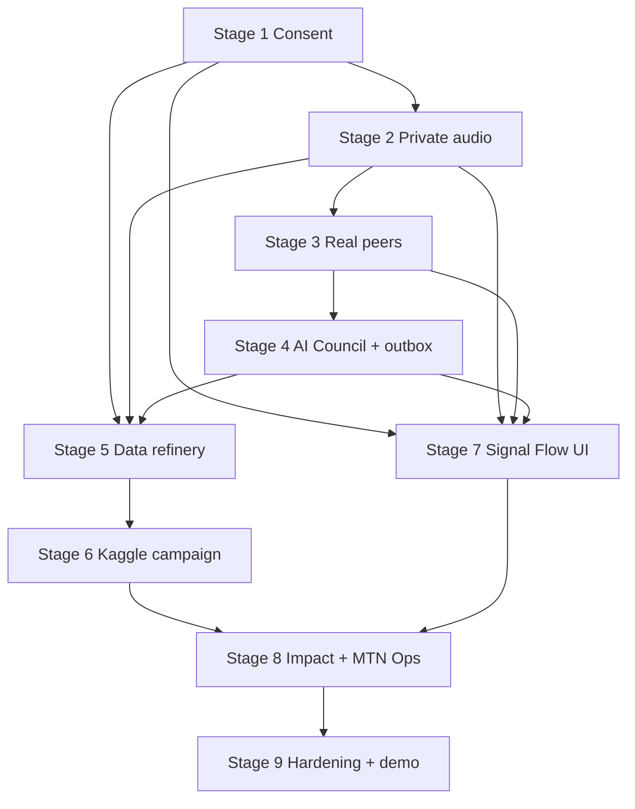

# AMAZWI Governed Intelligence Program Implementation Plan

> **For agentic workers:** REQUIRED SUB-SKILL: Use superpowers:subagent-driven-development (recommended) or superpowers:executing-plans to implement this plan task-by-task. Steps use checkbox (`- [ ]`) syntax for tracking.

**Goal:** Deliver the approved Governed Intelligence Flywheel as nine independently survivable stages without weakening peer authority, consent, financial integrity, privacy, or disclosure honesty.

**Architecture:** Extend the existing React, FastAPI, SQLAlchemy, Alembic, and PostgreSQL modular monolith. Keep consent, peer truth, rewards, payments, and export approval deterministic and transactional. Add private object storage, a PostgreSQL transactional outbox, advisory specialists, reproducible dataset manifests, evidence-gated model training, the Signal Flow UI, and an authorised MTN operations view behind focused interfaces.

**Tech Stack:** Python 3.11+, FastAPI, Pydantic, SQLAlchemy 2, Alembic, PostgreSQL 16, pytest, React 18, TypeScript 5.5, Vite 5, Vitest, Testing Library, Playwright, CSS/WAAPI, local private storage adapter, Kaggle notebooks/scripts, Hugging Face Transformers/PEFT, LightGBM, XGBoost.

## Global Constraints

- Peer verification is authoritative. AI runs only after a committed peer decision and is advisory.
- Declining `RETAIN_MODEL_DEVELOPMENT` never cancels an otherwise eligible configured reward.
- Active consent is derived server-side from `ConsentGrant` rows, never caller-supplied booleans.
- Production audio blobs never live in PostgreSQL and no bucket or object is public.
- No agent may change eligibility, money, consent, audio retention, campaign launch, export approval, or model aliases.
- Every reward/payment operation remains idempotent and transactional.
- The paused Vercel deployment remains paused until Lethabo explicitly reopens it.
- Cross-lane backend, money, data, and deployment work is pending Sbu's review and must be labelled as such in `BUILD_LOG.md` and `HANDOVER_SBU.md`.
- Existing `05_amazwi/plan/16_GOVERNED_INTELLIGENCE_DESIGN.md` is the product/design authority. Existing `02_TECH.md` financial and peer invariants remain binding.
- Use real PostgreSQL 16 for schema, migration, resolver, consent, outbox, and export tests. Do not substitute SQLite.
- TDD is mandatory. Each task starts with a failing test, reaches green, runs the relevant broader suite, and ends in a focused commit.
- No deployment, real payment, external dataset download, Kaggle GPU run, or Figma mutation without the gate-specific approval described below.

## Plan Set

1. `2026-09-01-amazwi-01-governance-audio-peers.md`
   - Stages 1–3: consent, private audio, real peer API.
2. `2026-09-01-amazwi-02-council-data-models.md`
   - Stages 4–6: transactional outbox, AI Council, data refinery, Kaggle model campaign.
3. `2026-09-01-amazwi-03-signal-flow-ops.md`
   - Stages 7–8: Signal Flow UI, both themes, motion, Impact and MTN Language Ops.
4. `2026-09-01-amazwi-04-hardening-demo.md`
   - Stage 9: security, deterministic reset, failure drills, target-device evidence.

## Locked File Structure

### Backend

- `starter/backend/app/config.py`: typed environment configuration and mode flags.
- `starter/backend/app/db.py`: SQLAlchemy engine/session dependency.
- `starter/backend/app/api_types.py`: Pydantic request/response contracts shared by routes.
- `starter/backend/app/consent.py`: active-scope queries, grants, revocations, enforcement and audit writes.
- `starter/backend/app/storage/base.py`: private audio adapter protocol and typed results.
- `starter/backend/app/storage/local.py`: local private storage implementation with signed, expiring access.
- `starter/backend/app/audio.py`: upload/finalise/playback/quarantine service.
- `starter/backend/app/cohorts.py`: closed-cohort peer selection.
- `starter/backend/app/outbox.py`: event insertion, claiming, retry and completion.
- `starter/backend/app/council.py`: specialist protocols, deterministic baseline specialists and orchestrator.
- `starter/backend/app/datasets.py`: source registry, licence/consent filtering and manifest approval.
- `starter/backend/app/routes/*.py`: focused FastAPI routers.
- `starter/backend/app/models.py`: canonical SQLAlchemy records and enums until a reviewed model split is justified.
- `starter/backend/app/main.py`: app construction and router registration only.

### Frontend

- `starter/frontend/src/api/client.ts`: fetch wrapper and typed failure mapping.
- `starter/frontend/src/api/contracts.ts`: API DTOs matching `api_types.py`.
- `starter/frontend/src/app/AppShell.tsx`: theme, navigation, mode label and route frame.
- `starter/frontend/src/components/*`: reusable Signal Flow primitives.
- `starter/frontend/src/features/consent/*`: consent experience.
- `starter/frontend/src/features/recording/*`: private recording/upload experience.
- `starter/frontend/src/features/verification/*`: verifier flow.
- `starter/frontend/src/features/receipt/*`: peer truth, advisory insight and reward receipt.
- `starter/frontend/src/features/impact/*`: Coverage Constellation and missions.
- `starter/frontend/src/features/ops/*`: authorised MTN Language Ops views.
- `starter/frontend/src/styles/*`: tokens, themes, materials, motion and accessibility.

### ML and data

- `starter/ml/requirements.txt`: reproducible CPU orchestration dependencies.
- `starter/ml/requirements-kaggle.txt`: pinned GPU/model dependencies.
- `starter/ml/amazwi_ml/manifest.py`: immutable manifest schema and canonical hashing.
- `starter/ml/amazwi_ml/splits.py`: speaker-safe deterministic splits.
- `starter/ml/amazwi_ml/metrics.py`: WER/CER, embedded-span error and tabular metrics.
- `starter/ml/amazwi_ml/tournament.py`: baseline/challenger comparison and promotion gate.
- `starter/ml/kaggle/*.py`: notebook-compatible scripts with explicit seeds and artefact output.
- `starter/ml/model_cards/*.md`: generated evidence reports, never hand-written winner claims.

## Dependency Graph

## Execution Order and Stop Rules

- [ ] **Wave 1:** Execute plan 01 through consent, local private storage and real peer API. Stop if any consent bypass, public-audio path, reward regression, or migration failure remains.
- [ ] **Wave 2:** Execute plan 02 through deterministic Council baselines and reproducible manifests. External downloads and Kaggle GPU execution require licence/terms and budget preflight; code and synthetic fixtures can proceed before that.
- [ ] **Wave 3:** Execute plan 03 after Signal Flow screens/tokens are reconciled with Figma file `JPZuFmbhRh9fhkgBLxRymq`. Do not claim Figma parity from static mockups alone.
- [ ] **Wave 4:** Execute plan 04 only after the integrated local workflow exists. Do not resume Vercel deployment as part of hardening.

## Program Acceptance

- [ ] Browser → API → private storage → two peers → resolver → reward → outbox → Council → receipt passes.
- [ ] Revocation blocks new playback, assignment and export while preserving earned money and audit evidence.
- [ ] AI-disabled mode preserves the complete peer/reward/receipt path.
- [ ] One immutable external-plus-opted-in dataset manifest rebuilds with identical canonical hash.
- [ ] Model promotion is blocked when a challenger fails its predeclared acceptance threshold.
- [ ] Signal Flow passes 320–480 px, 200% zoom, keyboard, screen-reader and reduced-motion checks in both first-class themes.
- [ ] Two deterministic reset-and-demo cycles pass on target devices.
- [ ] `P0.md`, `BUILD_LOG.md`, `HANDOVER_SBU.md`, `CLAUDE.md`, relevant READMEs and model/data cards report exactly what ran and what did not.

## Commit Policy

Use focused commits after each green task. Required message prefixes:

- `Consent:` governance and scope enforcement.
- `Audio:` private storage and quality flow.
- `Peers:` cohort, assignment and resolver API.
- `Council:` outbox and advisory specialists.
- `Data:` provenance and manifests.
- `ML:` evaluation and model campaign.
- `UI:` Signal Flow components and routes.
- `Ops:` impact and MTN operations.
- `Hardening:` failure handling, reset and evidence.
- `Docs:` build truth, handovers and evidence only.
